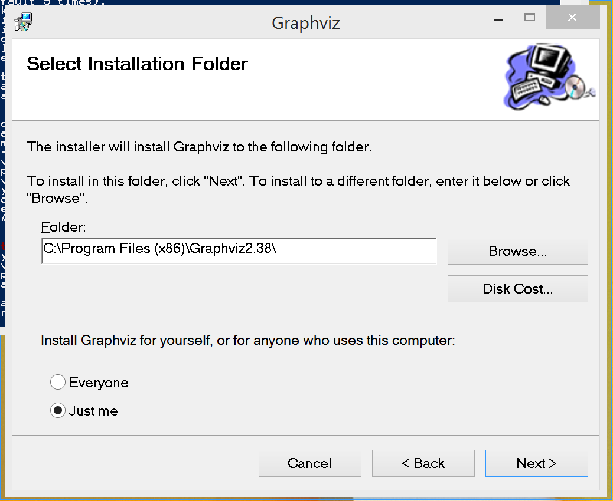

Using CollateX
==============

David J. Birnbaum (<djbpitt@gmail.com>), <http://www.obdurodon.org>  
Tara Andrews (<tla@mit.edu>), <http://byzantini.st/>

Last revised: 2015-05-25

## Overview

This tutorial explains how to install Python, CollateX, and IPython notebook for use in our CollateX workshop at DH2015 (Sydney). Workshop participants should install the software prior to the workshop.

## The short form

If you regularly use Python and other software, here are the instructions in a nutshell:

* Ensure Python 3, preferably the [Anaconda](http://continuum.io/downloads.html) distribution
* `pip install --pre collatex`
* `pip install python-levenshtein` (but see the [note below for Windows](#windows-levenshtein))
* Install Graphviz (either through a package manager such as apt-get or MacPorts, 
  or go to <http://www.graphviz.org/Download.php> and accept the license)
* `pip install graphviz`

If you are not sure what all that means, read on!

## Installation

To run CollateX, you need first to install Python 3 and then the CollateX module, along with some other programs, packages, and modules upon which CollateX depends. Here’s how to do that in Mac OS X, Ubuntu Linux, and Windows. The process described below will probably take between thirty minutes and an hour, depending on how familiar you are with installing programs on your system. The good news is that you only have to do the installation once, and launching CollateX after that will take almost no time. This tutorial assumes that you are running Mac OS X 10.8 or later, Windows 7 or 8, or Ubuntu Linux 14.04 LTS or later. 

In all of the steps below, if you are prompted to enter your password, you should do so.

### 1. Installing Python

Your system may already have some version of Python installed, but we recommend that you install and use the Anaconda Python distribution. CollateX will work with other distributions of Python 3, but the installation and configuration is more complicated, so for the workshop we are using Anaconda. Installing Anaconda according to the instructions on their site should not interfere with other existing Python versions on your system.

For Mac OS, Linux, and Windows, the Python installation instructions are the same: download and install Anaconda Python from <http://continuum.io/downloads.html>. **Be sure to click on the link that says <q>I want Python 3.4</q> before you download**. If you are curious, there’s a useful Anaconda quick-start tutorial at <https://store.continuum.io/static/img/Anaconda-Quickstart.pdf>.

#### Extra instructions for Linux users

The Anaconda package installer on Linux is not a clickable installation program as on Mac OS and Windows. You will need to choose to save the file, and then make a note of where the installer was saved (most likely your Downloads folder). You will then open a command line window (Ctrl-Alt-T on Ubuntu) to type the command

	bash Downloads/Anaconda3-2.2.0-Linux-x86_64.sh
	
(where `Downloads` is replaced with the name of the folder in which you saved Anaconda, if it is different.)

*Some users have reported errors when trying to install from the Download directory. Should that happen to you, try moving the file to your home directory and installing from there.*

When asked, say 'yes' to everything. When the installation is finished, type

	exit
	
to close the command line window. (You need to do this, even though you will open a new one shortly!)

### 2. Installing CollateX

####Using the command line

Once you have installed Python, as described above, you need to install CollateX, along with a few supporting files (*libraries*). To do this, you will need to work with a command line window. The ones we recommend are:

* For Mac OS X: the Terminal.app that you will find in the Applications → Utilities folder.
* For Windows: Windows Powershell, which you can find from the search box.
* For Ubuntu Desktop (Unity): you can type Ctrl-Alt-T or you can type <q>Terminal</q> (without the quotation marks) into the Search box.

A window will open that displays a command line, a place where you can type instructions to be executed on the computer, with a prompt that might look something like this:

	Taras-Mac:~ tara$ 
	
or this:

	PS C:\Users\Tara L Andrews> 
	
or this:

	tla@ubuntu:~$ 

Now you are ready to type the commands that come next.

_**Windows users:** Some of you may have used `cmd.exe` in the past, to work at the command line. We recommend Powershell because it uses many of the same commands that have always been in use on Unix-like systems, and so makes it easier for you to follow generic command-line instructions such as those we will be giving in the workshop. If you stick to `cmd.exe` you do so at your own risk._

#### The CollateX installation

The easiest way to install CollateX from the command line is with `pip`, a Python *package manager*. `pip` comes bundled with Anaconda, so you don’t have to install it separately, and you can install CollateX and the most of the libraries on which it depends by typing:

    pip install --pre collatex 
    
### 3. Installing the Python Levenshtein library

CollateX relies on this library to do inexact matching of words.

#### For Mac OS X and Linux

Type the following at the command line:

    pip install python-levenshtein
    
_**Mac OS users:** You may get a popup window telling you that you require the command-line developer tools. If you get this window, choose <q>Install</q>. When the installation is finished, run the command again._

Once this is done, you can check that everything worked with the following command:

	python -c "import Levenshtein; print('This works.')"

<h4 id="windows-levenshtein">For Windows</h4>

Windows users can try:

    pip install python-levenshtein

but this will succeed only if you have a C++ compiler configured. If you get an error message, you can instead install a precompiled binary version of the package, which you can do with the following:

* `pip install http://collatex.obdurodon.org/python_Levenshtein‑0.12.0‑cp34‑none‑win32.whl` (if your system is a 32-bit one)
* `pip install http://collatex.obdurodon.org/python_Levenshtein‑0.12.0‑cp34‑none‑win_amd64.whl` (if your system is 64-bit)

These files are mirrored from <http://www.lfd.uci.edu/~gohlke/pythonlibs/#python-levenshtein>. 

Once this is done, you can check that everything worked with the following command:

	python -c "import Levenshtein; print('This works.')"
    
### 4. Installing Graphviz

Graphviz is a program for creating graphic representations, including the *variant graphs* sometimes used in CollateX (see the examples at <http://stemmaweb.net/stemmaweb/relation/help/Latin>). Graphviz is required by CollateX only for viewing variant graphs. We recommend installing it for the workshop, but you can perform collations without it.

#### Installing Graphviz on Mac OS X

The easiest way to install Graphviz is to download the appropriate installer from [the Graphviz download page](http://www.graphviz.org/Download.php) (you will need to accept the license.) On Mac, this will be the <q>mountainlion</q> current stable release.

If the installer refuses to run when you double-click it, then you can do the following.

* Navigate to the installer in your Downloads folder.
* Right-click (or ctrl-click) to bring up the context menu.
* Choose <q>Open</q>. 
* When the warning dialog appears, choose <q>Open</q> again.

(This is a useful trick to remember for installing any software that you know you want, but that your Mac doesn’t trust.)

#### Installing Graphviz on Ubuntu Linux

Graphviz can be installed from the Terminal on Ubuntu with the command:

	sudo apt-get install graphviz

#### Installing Graphviz on Windows

The easiest way to install Graphviz on Windows is to download the appropriate installer from [the Graphviz download page](http://www.graphviz.org/Download.php) (you will need to accept the license.) On Windows, use the `.msi` file if you can.

When the installer shows the following screen:

copy the **full and exact** folder name down somewhere. When the installer is done, you will need to add this information to your execution path. 

1. From the Control Panel, choose System and Security → System → Advanced settings, and then click the <q>Environment variables</q> button near the bottom of the window.
2. Select the entry in the list that says <q>PATH</q> and choose <q>Edit</q>.
3. Scroll all the way to the end of whatever is already there, and add a `;` character, then the exact folder name you copied, and then `\bin`
4. To confirm that the path has been set correctly, close any open Powershell window you have, open a new one, and run the command:

		where.exe dot
		
	Do not leave off the `.exe`! The output should look like this:
	
		PS C:\Users\Tara L Andrews> where.exe dot
		C:\Program Files (x86)\Graphviz2.38\bin\dot.exe

### 5. Installing the Graphviz bindings for Python

In addition to Graphviz itself, you also need to install Python bindings (support) for Graphviz, which you can do at the command line by typing:

    pip install graphviz

Note that the preceding line does not install Graphviz; what it installs is the Python bindings for Graphviz. You also need to install Graphviz itself, as described in section 4, above.

## Environments

### IPython notebook

We will use the IPython notebook development environment in our workshop to write and test CollateX collations. IPython notebook is bundled with Anaconda Python and does not require any special installation. At the workshop we’ll describe how to use it to work with CollateX, but here are some preliminaries in case you want to test your installation.

#### Starting IPython notebook

To launch IPython notebook, at your command line type:

	ipython notebook
	
and wait for a window to open in your Web browser. You can ignore the command line after that; your interaction with IPython will happen entirely in the Web browser window.

If, for whatever reason, nothing happens in your Web browser, then once you see a pair of lines in the command-line terminal like:

	[I 23:14:13.260 NotebookApp] The IPython Notebook is running at: http://localhost:8888/
	[I 23:14:13.260 NotebookApp] Use Control-C to stop this server and shut down all kernels (twice to skip confirmation).
	
you can navigate in a browser to `http://localhost:8888/`

In rare cases some users may already be running another application that uses that address, in which case IPython notebook will refuse to start. You can tell IPython notebook to use a different address with:

    ipython notebook --port 8889

Numbers between 8889 and 8899 are likely to be free.

#### Using IPython notebook

To work with IPython notebook, on the web page that opens when you launch the program drop down the button labeled <q>New</q> in the upper right and select <q>Python 3</q>. We’ll describe how to use IPython notebook in the workshop, but if you already know a bit of Python, you can type Python commands into an empty cell and click the Run button (right-pointing triangle in the menu bar) or type Shift-Enter. The results of running your program will appear immediately below your code. For example, try typing the following into a cell in IPython notebook:

    from collatex import *
    collation = Collation()
    collation.add_plain_witness("A", "The quick brown fox jumps over the dog.")
    collation.add_plain_witness("B", "The brown fox jumps over the lazy dog.")
    alignment_table = collate(collation)
    print(alignment_table)

When you click the Run button, the results appear below the cell, and a new empty cell opens below that. To test your Graphviz integration, type:

    collate(collation,output="svg")

into the next cell and click Run again, and a graphic representation of the collation should appear below the cell. (The cells on an IPython notebook know about one another, so the graph is drawn using the information you typed into the first cell.)

### Command line

We typically use IPython notebook for experimentation and the command line for finished Python programs, and we’ll explain how to use CollateX from the command line in the workshop. If you are already familiar with working on the command line, you can save your Python code in a file (give it the traditional Python filename extension `.py`) and run it from the directory in which you’ve saved it with:

    python nameofscript.py

